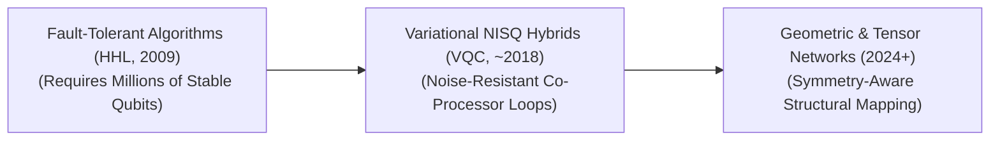

<!-- SEO: Quantum Machine Learning (QML), Quantum Computing, AI, Machine Learning, Noisy Intermediate-Scale Quantum, VQC, QCNN, Algorithms -->

 

# 🌌 Awesome-Quantum-Machine-Learning 🚀
## ⚛️ Quantum Machine Learning (QML): Evolution, Variants, & Applications

Quantum Machine Learning (QML) is an emerging discipline that merges quantum computing physics with classical machine learning architectures. By substituting classical bits (0 or 1) with quantum bits (qubits) capable of maintaining superposition and entanglement, QML aims to process highly complex, high-dimensional vector spaces. QML models are designed to find structural patterns in data that are computationally intractable for classical silicon hardware, tracking an algorithmic pathway toward true quantum advantage.

---

## ⏳ 1. The Chronological Evolution

The architectural progression of QML reflects a transition from theoretical, error-corrected quantum algorithms to hardware-aware variational hybrids, moving toward modern geometric and tensor-network integrations.

| Era | Concept | Limitation | Year First Used | Paper Link |
| --- | --- | --- | --- | --- |
| **[The Fault-Tolerant Era (Early Theoretical, ~2009–2017)](./pages/fault-tolerant-era.md)** | Rooted in exact mathematical speedups. Algorithms like the **HHL algorithm** (2009) unlocked exponential acceleration for solving linear systems of equations, forming the basis for early Quantum Principal Component Analysis (QPCA) and Quantum Support Vector Machines (QSVM). | Requires millions of physically stable, error-corrected qubits, which remain out of reach for current hardware generations. | 2009 | [HHL Paper](https://arxiv.org/abs/0811.3171) |
| **[The Variational & NISQ Era (~2018–2024)](./pages/variational-nisq-era.md)** | Adapted for **Noisy Intermediate-Scale Quantum (NISQ)** hardware. Instead of executing long, error-prone quantum algorithms, researchers developed **Variational Quantum Circuits (VQCs)**. These operate as hybrid loops where a noisy quantum chip evaluates a quantum state, and a classical optimizer updates circuit parameters step-by-step. | N/A | 2014 | [McClean et al.](https://arxiv.org/abs/1509.04279) |
| **[The Geometric & Native Tensor Era (~2024–Present)](./pages/geometric-tensor-era.md)** | Shifts focus toward inductive biases and physics alignment. Modern QML exploits **Quantum Convolutional Neural Networks (QCNNs)** and **Geometric QML** to enforce structural symmetries, bypassing systemic bottlenecks like barren plateaus (vanishing gradients) by matching the circuit architecture directly to the dataset's topological geometry. | N/A | 2019 | [Cong et al.](https://arxiv.org/abs/1810.03787) |

---

## 🔲 2. Core Operational Variants (The 4-Quadrant Matrix)

QML methodologies are strictly categorized based on whether the underlying data source and the processing computer infrastructure are classical or quantum in nature.

| Variant | Mechanism | Details | Year First Used | Paper Link |
| --- | --- | --- | --- | --- |
| **[CC (Classical Data $\rightarrow$ Classical Computer)](./pages/cc-classical-classical.md)** | Standard machine learning. Conventional neural networks processing everyday datasets (text, images) on silicon CPUs/GPUs. This serves as the computational baseline. | N/A | 1950s | [Turing, 1950](https://academic.oup.com/mind/article/LIX/236/433/986238) |
| **[QC (Quantum Data $\rightarrow$ Classical Computer)](./pages/qc-quantum-classical.md)** | Using classical machine learning to analyze raw quantum mechanics outcomes. | *Example:* Training a classical convolutional network or random forest on data from physical particle colliders to classify phase transitions or detect novel quantum states. | 2017 | [Carrasquilla & Melko](https://arxiv.org/abs/1605.01735) |
| **[CQ (Classical Data $\rightarrow$ Quantum Computer)](./pages/cq-classical-quantum.md)** | Mapping classical real-world datasets into quantum states to execute processing on a quantum processor unit (QPU). | *Challenge:* Requires complex **Quantum Feature Maps** (such as amplitude or angle encoding) to convert classical vectors into operational qubit states. | 2014 | [Rebentrost et al.](https://arxiv.org/abs/1307.0471) |
| **[QQ (Quantum Data $\rightarrow$ Quantum Computer)](./pages/qq-quantum-quantum.md)** | The purest variant. Quantum states derived straight from physical systems are fed directly into a QPU without undergoing classical translation or measurement degradation. | *Application:* Simulating molecular bonds, chemical reactions, or subatomic matrix fields natively. | 1982 | [Feynman, 1982](https://link.springer.com/article/10.1007/BF02650179) |

---

## 🏗️ 3. Structural Circuit & Model Types

These variations define the specific internal configurations of gates and layers within a quantum machine learning algorithm.

| Model Type | Mechanism | Year First Used | Paper Link |
| --- | --- | --- | --- |
| **[Variational Quantum Classifiers (VQC)](./pages/variational-quantum-classifiers.md)** | The quantum analogue to classical Multi-Layer Perceptrons. It passes data through a parameterized quantum circuit composed of rotation gates ($R_x, R_y, R_z$) and entangling CNOT gates, optimizing the rotation angles to execute data classification. | 2018 | [Farhi & Neven](https://arxiv.org/abs/1802.06002) |
| **[Quantum Convolutional Neural Networks (QCNN)](./pages/quantum-convolutional-neural-networks.md)** | Replicates vision networks. Applies interleaved sequences of convolutional layers (qubit-entangling operations) and pooling layers (qubit-measurement reductions) to classify multi-qubit states while preserving spatial translational invariance. | 2019 | [Cong et al.](https://arxiv.org/abs/1810.03787) |
| **[Quantum Generative Adversarial Networks (QGAN)](./pages/quantum-generative-adversarial-networks.md)** | Maps the classic minimax game into a quantum workspace. A quantum generator circuit attempts to synthesize fake quantum states that can bypass a classical or quantum discriminator network, accelerating generative modeling for complex probability distributions. | 2018 | [Lloyd & Weedbrook](https://arxiv.org/abs/1804.09139) |

---

## 🚧 4. Fundamental Theoretical Bottlenecks

Developing functional QML requires mitigating explicit physical limits that do not exist within standard silicon-based deep learning pipelines.

| Bottleneck | The Phenomenon | Year First Used | Paper Link |
| --- | --- | --- | --- |
| **[Barren Plateaus (The Vanishing Gradient Tax)](./pages/barren-plateaus.md)** | As the number of qubits or circuit depth scales up, the gradient of the parameter space flattens out exponentially. This leaves the optimization landscape completely featureless, causing classical optimizers to fail during training. | 2018 | [McClean et al.](https://arxiv.org/abs/1803.11173) |
| **[The No-Cloning Theorem Constraint](./pages/no-cloning-theorem.md)** | Quantum mechanics dictates that it is physically impossible to create an identical copy of an arbitrary, unknown quantum state. This completely prevents models from caching intermediate states or duplicating raw inputs for parallel backpropagation loops. | 1982 | [Wootters & Zurek](https://nature.com/articles/299802a0) |

---

## 🌍 5. Frontier Real-World Applications

| Application | Details | Year First Used | Paper Link |
| --- | --- | --- | --- |
| **[De Novo Quantum Chemistry & Material Synthesis](./pages/quantum-chemistry.md)** | *Application:* Accelerates molecular configuration tracking for drug discovery and next-generation battery design. QML models map electron cloud probability fields natively, bypassing the exponential scaling limits that cause classical supercomputers to crash when simulating complex chemical compounds. | 2014 | [Peruzzo et al.](https://arxiv.org/abs/1304.3061) |
| **[High-Dimensional Financial Optimization](./pages/financial-optimization.md)** | *Application:* Optimizes global macro-asset portfolios or cracks high-frequency derivative pricing equations. QML feature maps project volatile asset correlation metrics into infinite-dimensional Hilbert spaces, discovering hidden market patterns and risk boundaries faster than classical Monte Carlo simulations. | 2018 | [Rebentrost et al.](https://arxiv.org/abs/1811.03975) |
| **[Quantum Error Mitigation Correction](./pages/error-mitigation.md)** | *Application:* Deployed directly into the quantum computing control stack. Specialized QML models learn the physical noise signatures of specific QPU architectures at runtime, actively predicting and cancelling out environmental thermal decoherence to prolong physical qubit execution windows. | 2017 | [Li & Benjamin](https://arxiv.org/abs/1611.09301) |

## 🌟 Star History

<a href="https://www.star-history.com/?repos=ishandutta2007/Awesome-Quantum-Machine-Learning&type=date&legend=bottom-right">
<picture>
<source media="(prefers-color-scheme: dark)" srcset="https://api.star-history.com/chart?repos=ishandutta2007/Awesome-Quantum-Machine-Learning&type=date&theme=dark&legend=bottom-right" />
<source media="(prefers-color-scheme: light)" srcset="https://api.star-history.com/chart?repos=ishandutta2007/Awesome-Quantum-Machine-Learning&type=date&legend=bottom-right" />

</picture>
</a>

